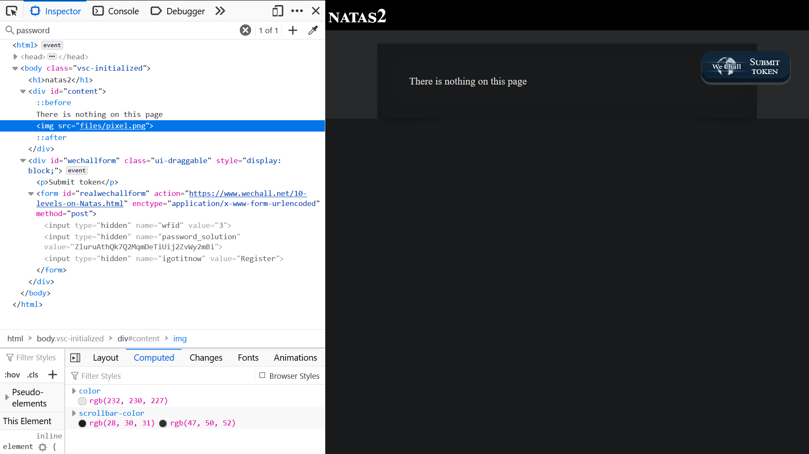
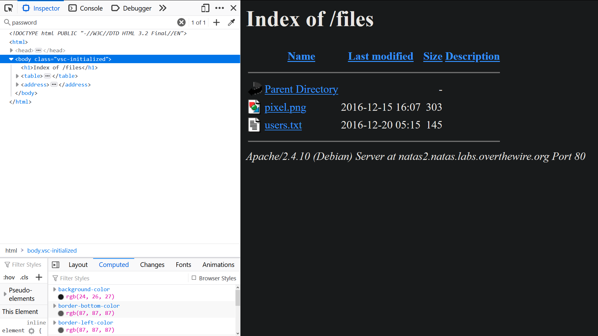
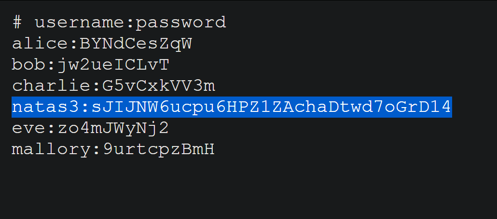

# Natas Level 2

A webpage that displays the message: `There is nothing on this page`.

There is a hidden directory on the webpage ("files").



We can access this directory to see if there are any other files by appending `/files` to the url.

`http://natas2.natas.labs.overthewire.org/files`



# users.txt in `/files`



```
# username:password
natas3:sJIJNW6ucpu6HPZ1ZAchaDtwd7oGrD14
```

# PASSWORD to natas3

sJIJNW6ucpu6HPZ1ZAchaDtwd7oGrD14
