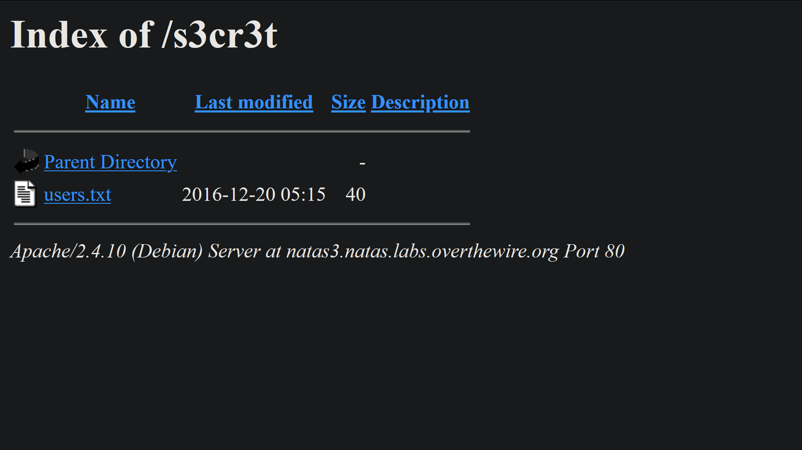

# Natas Level 3

A webpage with the message:

`There is nothing on this page`

Using the inspector, we see the following information:

```
There is nothing on this page
<!-- No more information leaks!! Not even Google will find it this time... -->`
```

# [World Wide Web](https://developer.mozilla.org/en-US/docs/Glossary/World_Wide_Web)

The `World Wide Web` (WWW, W3, the Web) is an interconnected system of public webpages accessible through the Internet. The Web is not the same as the Internet: the Web is one of the many applications built on top of the Internet.

The system we know today as "the Web" consists of several components

1. The `HTTP` protocol governs data transfer between a server and a client
1. To access a Web component, a client supplies a `unique universal identifier`, called a `URL` (uniform resource location) or `URI` (uniform resource identifier) (formally called Universal Document Identifier (UDI)).
1. `HTML` (hypertext markup language) is the most common format for publishing web documents.

Linking, or connecting resources through hyperlinks, is a defining concept of the Web, aiding its identity as a collection of connected documents.

# Hyperlinks

Hyperlinks connect webpages or data items to one another. In HTML, `<a>` elements define hyperlinks from a spot on a webpage (like a text string or image) to another spot on some other webpage (or even on the same page).

# [What is an Internet search engine?](https://developer.mozilla.org/en-US/docs/Glossary/Search_engine)

An Internet search engine is a software system that collects information on the World Wide Web and presents it to users who are looking for specific information.

A search engine conducts the following processes

1. Web crawling

   Searching web sites by navigating Hyperlinks on web pages, both within aa site, and from one site to another. A web site owner can exclude areas of the site from being accessed by a search engine's web crawler (or spider), by defining "robot exclusion" information in a file named `robots.txt`

1. Indexing

   Associating keywords and other information with specific web pages that have been crawled. This enables users to find relevant pages as quickly as possible.

1. Searching

   Looking for relevant web pages based on queries consisting of key words and other commands to the search engine. The search engine finds the URLs of pages that match the query, and ranks them based on their relevance. It then presents results to the user in order of the ranking.

# [Introduction to `robots.txt`](https://support.google.com/webmasters/answer/6062608?hl=en)

A `robots.txt` file tells search engine crawlers which pages or files the crawler can or can't request from your site.

This is used mainly to avoid overloading your site with requests; _it is not a mechanism for keeping a web page out of Google_

To keep a web page out of Google, you should use [noindex directives](https://developers.google.com/search/reference/robots_meta_tag), or password-protect your page.

# [Create a robots.txt file](https://support.google.com/webmasters/answer/6062596?hl=en)

A `robots.txt` file lives at the root of your site. So, for site `www.example.com`, the `robots.txt` file lives at `www.example.com/robots.txt`. `robots.txt` is a plain text file that follows the [Robots Exclusion Standard](https://en.wikipedia.org/wiki/Robots_exclusion_standard#About_the_standard). A robots.txt file consists of one or more rules. Each rule blocks (or or allows) access for a given crawler to a specified file path in that website.

# Natas3 robots.txt

http://natas3.natas.labs.overthewire.org/robots.txt

```
User-agent: *
Disallow: /s3cr3t/
```

`Disallow`: A directory or page, relative to the root domain, that should not be crawled by the user agent.

    If a page, it should be the full page name as shown in the browser;

    If a directory, it should end in a / mark.

    Supports the * wildcard for a path prefix, suffix, or the entire string.

# Checking http://natas3.natas.labs.overthewire.org/s3cr3t/



In `users.txt` (http://natas3.natas.labs.overthewire.org/s3cr3t/users.txt):

`natas4:Z9tkRkWmpt9Qr7XrR5jWRkgOU901swEZ`

# PASSWORD to natas4

Z9tkRkWmpt9Qr7XrR5jWRkgOU901swEZ
