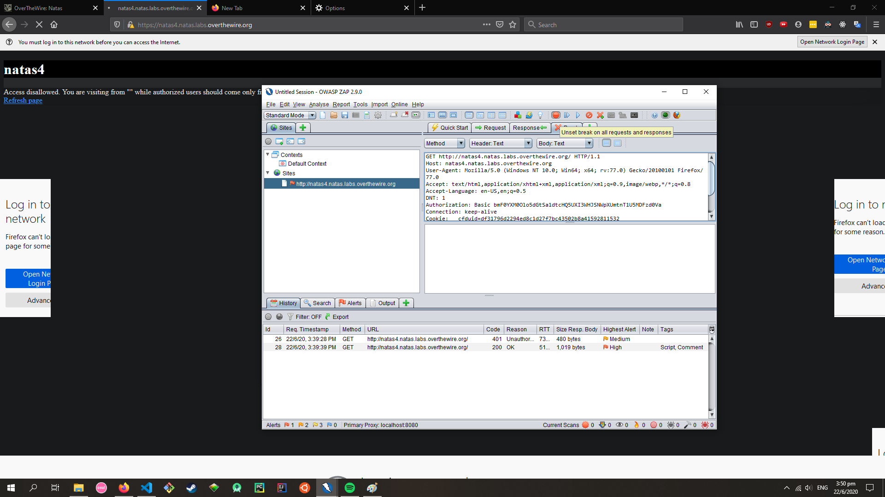
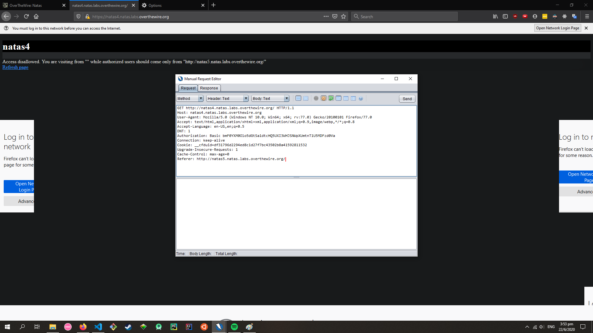

# Natas Level 4

A webpage with the following message:

Access disallowed. You are visiting from "" while authorized users should come only from "http://natas5.natas.labs.overthewire.org/"

# [HTTP Headers](https://developer.mozilla.org/en-US/docs/Web/HTTP/Headers)

HTTP headers let the client and server pass additional information with an HTTP request or response. An HTTP header consists of its case-insensitive name followed by a colon (:), then by its value. Whitespace before the value is ignored.

Headers can be grouped according to their contexts:

1. General headers

   Apply to both requests and responses, but with no relation to the data transmitted to the body.

1. Request headers

   Contain more information about the resource to be fetched, or about the client requesting the resource.

1. Response headers

   Hold additional information about the response, like its location or about the server providing it.

1. Entity headers

   Contain information about the body of the resource, like its content length or MIME type.

Under Request context

1. Referer

   The address of the previous web page from which a link to the currently requested page was followed. The `Referer` header allows servers to identify where people are visiting them from and may use that data for analytics, logging, or optimized caching, for example.

# [OWASP ZAP](https://www.zaproxy.org/)

OWASP ZAP is an open-source web application security scanner. It is intended to be used by both those new to application security as well as professional penetration testers. It is one of the most active Open Web Application Security Project projects and has been given Flagship status

Proxy Web Traffic through OWASP ZAP
https://www.youtube.com/watch?v=ICPqz1Al9fk

1. Tools -> Options -> Local Proxies
1. Update browser proxy (e.g. Firefox) to use same address and port indicated in ZAP
1. Add breakpoint in ZAP, refresh website
   
1. Update HTTP headers in GET request

   Add `Referer: http://natas5.natas.labs.overthewire.org/`
   

1. Send request and check response

   `Access granted. The password for natas5 is iX6IOfmpN7AYOQGPwtn3fXpbaJVJcHfq`

# PASSWORD to natas5

iX6IOfmpN7AYOQGPwtn3fXpbaJVJcHfq
